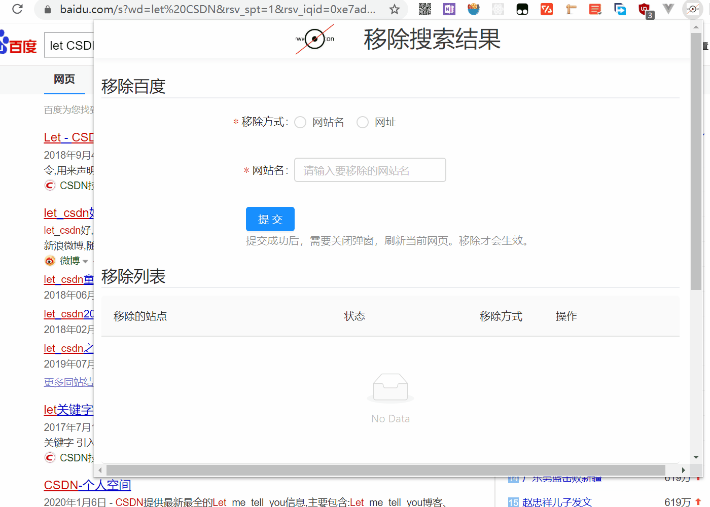

# remove-search-result
 
 

It's chrome extension which can remove [Baidu](https://www.baidu.com/)'s 
search results of specific site. It's easy to use. Just input site name or
 url, it will do the rest things. 
 

* Of course, you can add any website to block. But, it won't remove the official website at first place.
* It works both site name and url.
* You can modify existing remove list. 
* You can always disable this remove actions at anytime. You don't have to disable the hole extension.

# Tech
* Use [React](https://reactjs.org) and [Webpack](https://webpack.js.org/) in Popup page. 
* Support hot reload [by mv3-hot-reload](https://github.com/pacexy/mv3-hot-reload)
* A better UI with [Ant Design](https://ant.design).

The Baidu's users are mostly Chinese. So, our current UI is Chinese. 
If you want an English version of this extension,
please issue me. I'm glad to do in subsequent updates.

# Demo

# Use
1. Click extension icon and input website'name or url. Submit.
2. Close popup page, and refresh current page. 

The annoying website's gone from you sight. Go and have a try!

# Development
You also can create you own Chrome extension by fork this project. 

1. Install all the required packages/dependencies using npm `npm install`. 

2. Run `npm run hotReload` to hot reload extension.

3. Build extension files `npm run dev`. Copy project directory.

4. Enter url `chrome://extensions/` in your Chrome.

5. Click 'Load unpacked' button. Paste in explore window. 
When you see the extension icon in your Chrome, it means the extension had built successfully.

# README.md
* zh_CN [简体中文](README_zh_CN.md) 👈
* [English](README.md) 👈
