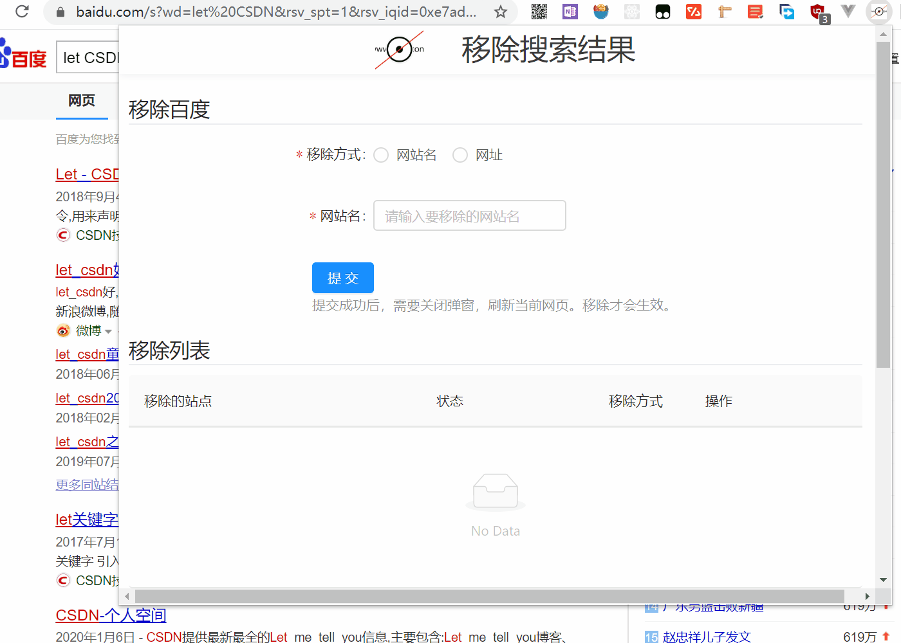

# block-search-result

 
 
这是一款可以移除[百度](https://www.baidu.com/)搜索结果的浏览器扩展。
只需要打开弹窗，输入网站名或链接即可。如果你喜欢，欢迎给我提 issue！

* 可以选择屏蔽大部分网站，但是，不会屏蔽搜索结果首位的官网。也许有一天，您真的想访问这个网站。
* 支持按照网站名屏蔽或者按照链接屏蔽。
* 可以针对已存在的移除列表进行修改和删除。
* 您总是可以关闭某个网站的移除效果，通过在列表里选择禁用。而不是禁用整个扩展。

# Tech
* 在 Popup 页面中使用了 [React](https://reactjs.org) 和 [Webpack](https://webpack.js.org/)
* 支持热加载
* 用户界面使用了 [Ant Design](https://ant.design)

# Demo

# Use
1. 点击扩展的图标，在弹窗打开后，输入您想要屏蔽的网站名或链接。然后，点击提交按钮。
2. 再次点击图标，关闭弹窗。刷新页面，屏蔽就生效了。

# Development
您也可以在此扩展程序的基础上，进一步创建自己的 Chrome 扩展。

1. 安装依赖运行 `npm install`. 

2. 创建扩展包运行 `npm run dev`。复制项目的文件目录。

3. 在浏览器输入链接 `chrome://extensions/` ，扩展控制页面。

4. 选择「加载已解压的扩展程序」，黏贴文件目录，选择 build。浏览器出现扩展图标，说明 build 成功了。

# README.md
* zh_CN [简体中文](README_zh_CN.md) 👈
* [English](README.md) 👈
